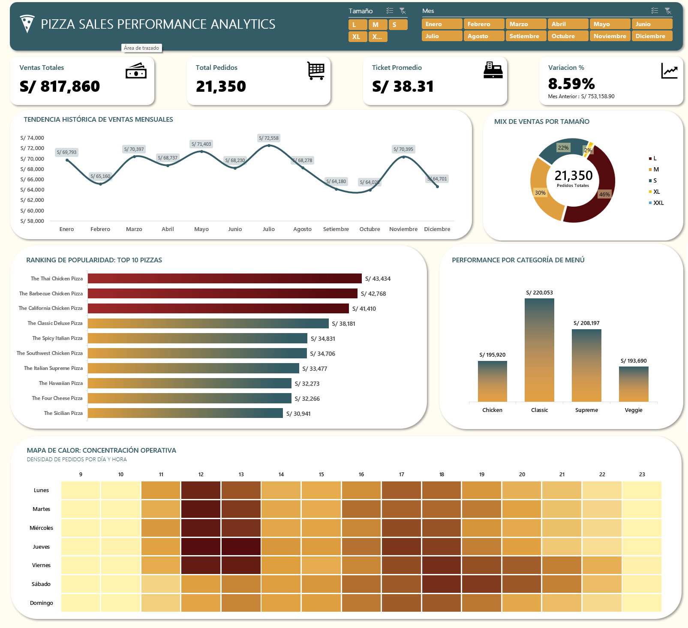

# 🍕 Dashboard BI de Ventas — Pizzería

## 🎯 Objetivo

Identificar patrones de demanda horaria y evaluar la rentabilidad del menú para optimizar la asignación de personal y los niveles de inventario.

---

## 📁 Estructura del repositorio

```
pizzeria-excel-bi/
│
├── PizzaDashboard.xlsx    # Modelo de datos + dashboard interactivo
└── README.md
```

---

## 🛠️ Stack utilizado

- **Excel Avanzado** — Power Query, Power Pivot, DAX
- **Modelado de datos** — Esquema estrella
- **Diseño UI/UX** — Dashboard interactivo con segmentadores

---

## ⚙️ Flujo de trabajo

### Fase 1 — ETL con Power Query
- Extracción y limpieza de datos desde múltiples fuentes CSV
- Normalización de tipos de datos y estandarización de campos
- Carga al modelo de datos de Power Pivot

### Fase 2 — Modelado de datos
- Construcción de un esquema estrella con tablas de hechos y dimensiones
- Relaciones entre tablas para análisis multidimensional

### Fase 3 — Métricas con DAX
- Creación de medidas para KPIs de ventas, volumen e ingresos
- Cálculos de participación por categoría y tamaño

### Fase 4 — Dashboard interactivo
- Visualizaciones interactivas con segmentadores dinámicos
- Análisis de demanda por franja horaria
- Distribución de ingresos por categoría y tamaño de pizza

---

## 💡 Hallazgos principales

**1. Patrón de doble pico de demanda**
La demanda se concentra en dos franjas horarias: almuerzo y cena. Este patrón permite optimizar la distribución del personal por turno.

**2. Tamaños XL y XXL son ineficientes**
Representan menos del 2% de los ingresos totales, evidenciando una oportunidad de simplificación del menú y reducción de inventario.

**3. Volumen significativo**
Se procesaron más de 21,350 órdenes con una facturación total de $817,860 USD, lo que valida la representatividad del análisis.

---
## 📊 Dashboard



---

## 📂 Dataset

- **Fuente:** [Pizza Place Sales — Maven Analytics](https://mavenanalytics.io/data-playground/pizza-place-sales)
- **Registros:** +21,350 órdenes
- **Facturación total:** $817,860 USD
- **Variables:** fecha, hora, tipo de pizza, tamaño, cantidad, precio

---

## ▶️ Cómo ejecutar

1. Descarga el archivo `PizzaDashboard.xlsx`
2. Ábrelo con **Microsoft Excel 2016 o superior** (requiere Power Pivot habilitado)
3. Si Power Pivot no está activo: `Archivo → Opciones → Complementos → Complementos COM → Microsoft Power Pivot`
4. Usa los segmentadores del dashboard para explorar los datos interactivamente

---

*Proyecto de análisis de datos con Excel Avanzado — portafolio personal*
